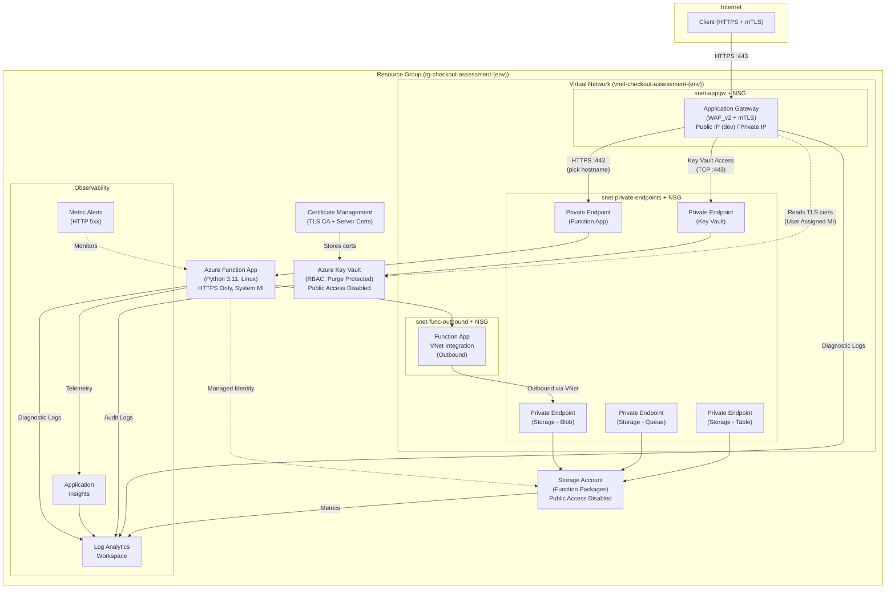
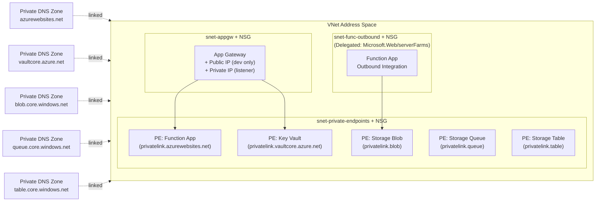
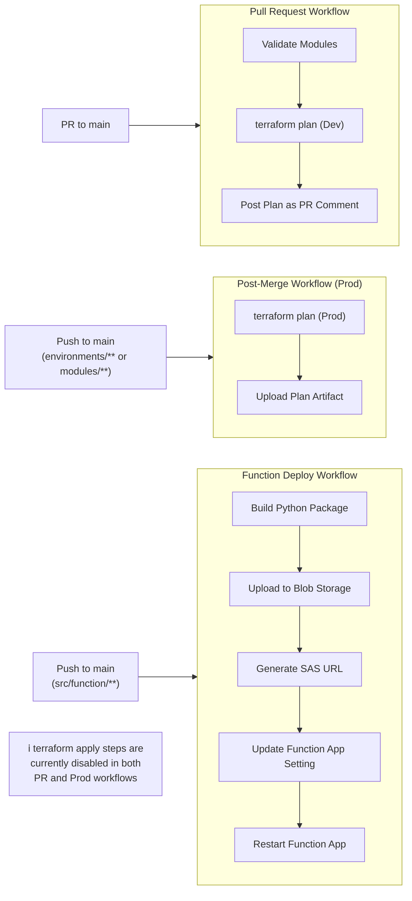

# Architecture Overview

## High-Level Architecture

The Checkout Platform runs on Azure, deployed via Terraform with a modular structure supporting multiple environments (dev, prod).



## Network Architecture

All services communicate through **private endpoints** within the VNet. Public access is disabled on the Function App, Key Vault, and Storage Account. Each subnet has a **Network Security Group (NSG)** with least-privilege rules.



## CI/CD Pipeline Architecture



## Terraform Module Dependency Graph

```mermaid
flowchart TD
    Env["environments/{dev,prod}/main.tf"] --> Infra["module: infrastructure"]

    Infra --> VNet["module: vnet\n• VNet\n• 3 Subnets"]
    Infra --> KV["module: key_vault\n• Key Vault\n• Private Endpoint\n• Private DNS Zone\n• RBAC Roles"]
    Infra --> FS["module: function_storage\n• Storage Account\n• Private Endpoints (Blob, Queue, Table)\n• Private DNS Zones"]
    Infra --> Func["module: function\n• Service Plan\n• Linux Function App\n• Private Endpoint\n• Private DNS Zone\n• RBAC Roles"]
    Infra --> Cert["module: certificate_management\n• TLS CA Key/Cert\n• Server Key/Cert\n• Key Vault Secrets"]
    Infra --> AppGW["module: app_gateway\n• App Gateway (WAF_v2)\n• User Assigned Identity\n• Public IP\n• mTLS SSL Profile"]
    Infra --> Obs["module: observability\n• Log Analytics Workspace\n• Application Insights\n• Metric Alerts"]

    KV --> Cert
    Cert --> AppGW
    VNet --> KV
    VNet --> FS
    VNet --> Func
    VNet --> AppGW
    FS --> Func
    Func --> Obs
    Func --> AppGW
    KV --> AppGW
